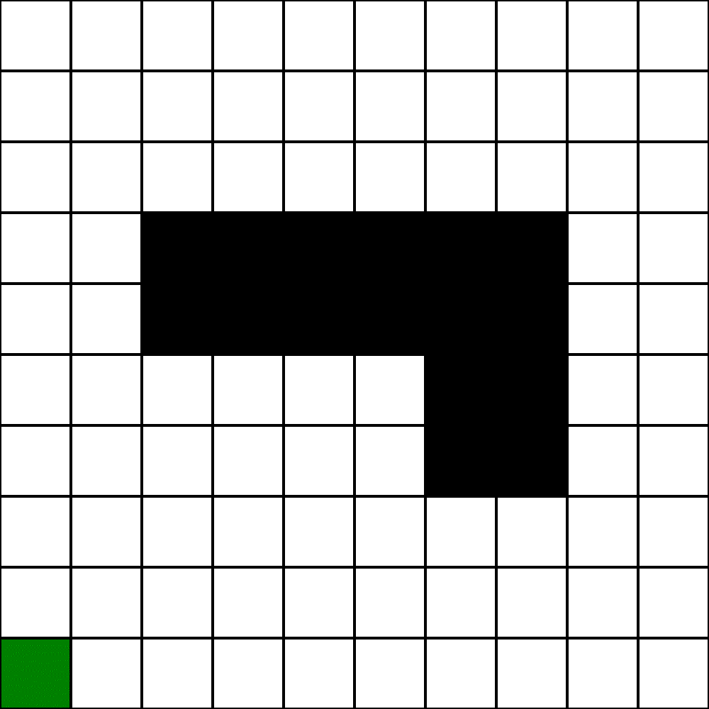

# Illustration of [A*](https://en.wikipedia.org/wiki/A*_search_algorithm) algorithm work
---
## In taxicab space
[[Info](https://en.wikipedia.org/wiki/Taxicab_geometry)]

---
## As dijkstra
[[Info](https://en.wikipedia.org/wiki/Dijkstra%27s_algorithm)]

---
## General
[[Info](https://en.wikipedia.org/wiki/A*_search_algorithm)]

---
## AlphA*
[[Info](https://en.wikipedia.org/wiki/A*_search_algorithm#Bounded_relaxation)]

---
## A* with dynamic weighting
[[Info](https://www.cs.auckland.ac.nz/courses/compsci709s2c/resources/Mike.d/Pohl1973WeightedAStar.pdf)]

